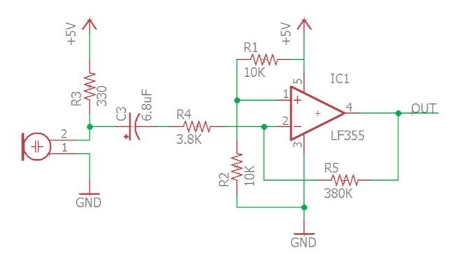
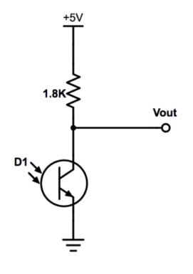
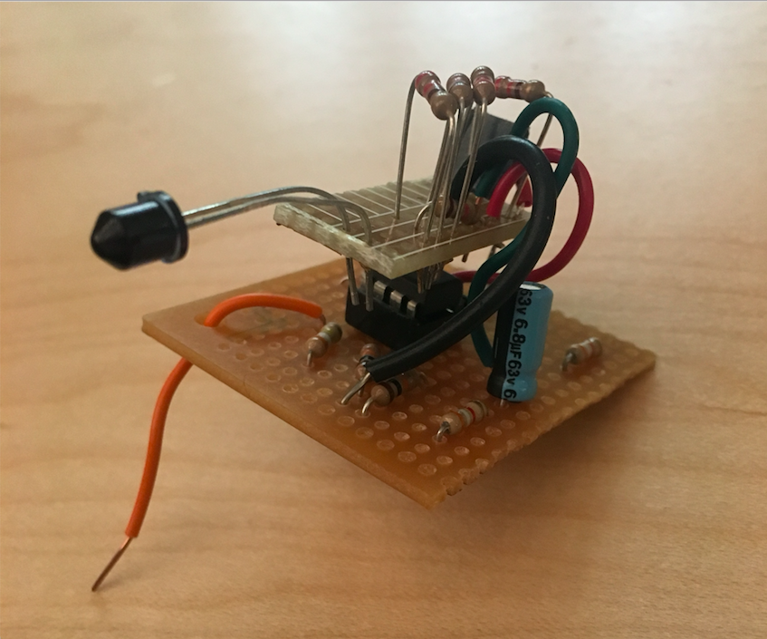

# Final Robot

The Final Robot design had the below main features.
1. Radio Communication : For transmitting maze data to base station.
2. Overall Design Aesthetics : For better Stability.
3. Frequency analysis : For audio and collision avoidance. 
4. Modified DFT with path planning : for maze traversal.
5. Object detection : For detecting colors and shape of objects. 


## 1. Radio Communication 

In order to get the Robot to communicate to base station wirelessly, we used 2 Nordic RF chips. We synchronized them using a common channel. We used the RF24 Arduino library for setup. The configuration settings in the RF code were drawn from the given configuration settings, though we made made few changes, increased power (max) and data rate (2MBPS) and a decreased payload size for more reliability (8 bytes). Since the robot was always sending information and the base station was always receiving it, we found the role switching capabilities of the original code to be unnecessary. Both pipes for reading and writing were set from the beginning and we found no need for the base station to send information for the robot to receive beyond an acknowledgment of a successfully received message. As a result, the final RF code used for this lab was significantly cut down in length while still remaining functional.  
<br>
The protocol for communication between the base and robot was based on a two byte integer named *data* on the robot that is updated, sent to the base, and then cleared at every intersection. Whenever the robot hits an intersection, based on its current heading, it updates its position and scans the walls around it. The appropriate bits are set in data and then data is sent to the base. We also update and send data after seeing a robot. After it is sent, data is reset to 0x0000 to ensure information for future transmissions does not contain pieces of previous transmissions.
The encoding for data is as follows:  
<br>
Nibble 1  
[0:3] - Robot x co-ordinate (Range is 0-8 since its a 9 * 9 matrix)  
<br>
Nibble 2  
[4:7] - Robot y co-ordinate (Range is 0-8 since its a 9 * 9 matrix)  
<br>
Nibble 3  
[8] - West Wall ( 0 - no wall ; 1 - wall exists )  
[9] - North Wall ( 0 - no wall ; 1 - wall exists )  
[10] - East Wall ( 0 - no wall ; 1 - wall exists )  
[11] - South Wall ( 0 - no wall ; 1 - wall exists )  
<br>  
Nibble 4  
[12-14] - Treasure Type  ( Predetermined treasure type codes as below)  
No Treasure = 0;  
Blue Triangle = 1; 	Blue Square = 2;	 Blue Diamond = 3;  
Red Triangle = 4; 	 Red Square = 5; 	  Red Diamond = 6;  
[15] - Opponent Robot ( 0 - no Robot exists ; 1 - Robot obstructing path )  
<br>
Once the robot sends the base station a message with all of the information encoded in the format described above, the base station decodes the message with the use of bit masking and bit shifting in order to extract information from specific bits. The base station iterates over the bits of the message and prints (without newlines) the information contained within them. For example, if our robot detects another robot, bit 15 will be set to 1 and the base station will print “,robot=true”. Once the message has been fully parsed and interpreted, it prints a new line so that the GUI will receive the information and update accordingly.  

## 2. Overall Design Aesthetics

### 2.1 Printed Circuit Board
As encouraged by the course staff, we decided to build a printed circuit board (PCB) to both clean up our wiring for our final robot and to remove the problem of wires falling out that is inherent when using a breadboard. The idea for the PCB is that the PCB would sit like a 'hat' on the Arduino and have headers for all sensors and other inputs. We used EAGLE PCB Design Software to design the PCB. 

The first step in this process was creating the schematic. This involved downloading all the parts we are using from online libraries and wiring everything as we have on the breadboards. A library was  downloaded for the multiplexor and for the Arduino to ensure the dimensions of the pinouts and spaces were all correct. Here is a picture of the schematic.


The next part of the process was to use the schematic to layout the board. First, all components were placed on the board. When placing the components on the board, all pins on each component have straight 'air wires' that show which pins on other components the given pin needs to be wired to. So, when placing the components, it is most ideal to have as few 'air wires' crossing each other as to make wiring the components easier later.

We chose to have a 2-layer board. The bottom layer is ground. This simplifies the wiring because it allows all pins that need to be grounded to be shorted to the bottom layer instead of all being wired together. After creating the ground layer, we started connecting the wiring on the top layer. After choosing a trace width of about 0.6 mm as determined by the max voltage of 5V, with as straight wires as possible, we wired all components together. Because some wires cross, some wires need to go through a via, to the bottom layer to go under the wires they intersect with when being routed. Here is a picture of the schematic. Red wires are through the top layer and blue wires are through the bottom layer.


The PCB ultimately failed because of the PCB mill we used to print it. We were not able to level the board properly so each time we milled the board, some parts of the board were cut to deep so there was no path for signal, and in some place its was not cut deep enough and the copper was not broken through and thus the signal was shorted with the whole level. We tried for a long time to level the board but we eventually gave up. We realized that even if we finally printed the first side correctly by luck, we would also have to print the second side perfectly. Since we would not be so lucky twice in a row, we decided to give up on the PCB and put our circuitry on protoboards.

Below is a picture of a failed PCB. On the top left of the board, you can see that the mill did not cut through the copper so that trace would be shorted with the rest of the layer. At the same time, on the right side, the mill cut so deep  that there is no copper left to transport the signal. This issue was caused by the uneven base of the mill. This caused us to put our circuit on a protoboard instead of using the PCB.


### 2.2 Proto Boarding

Once we realized that the printed circuit board would not work, we decided to move all our circuitry to protoboards. We moved the amplifiers, multiplexer, headers, LEDs, and microphone to small protoboards cut to the needed size as to be as small as possible. We used protoboards that had rows of holes connected by small copper pieces that imitate a breadboard to clean up the soldering work. Most boards connected to a head on the arduino. Three boards were on top of the robot, one with the push button, one with the microphone and its amplifier, and one for the IR sensor. 

Here is an example of a protoboard we used for digital pins 0 through 7. 


On the top right you can see the 8 pins that connect right into the Arduino. 3 of the pins are used as select bits for the mux (the long central chip). Two of the top pins are used as PWM ports to control the servos, and the servos plug into the headers on the top left. The bottom blue wire is the audio input to the amplifier and the grey wires are both the output of the amplifier (one is unsoldered so it can be used for testing on an oscope). On the left, you can see three headers that are the wall sensors. All three wall sensors are inputs to the mux. Finally, on the right, there are two single pin headers, one is the output of the mux, and one is where the IR signal is an input to the mux.

The rest of the protoboards were very similar but with the required pins for the given Arduino headers and inputs. There were additional protoboards made for the push button, microphone, IR sensor and amplifier, Arduino analog pins 0 through 5, and radio module.

## 3.Frequency Analysis

On our final robot, we had a microphone to detect 660 Hz audio sound to signal the robot to start, and an IR sensor to detect other robots emitting IR at 6.08kHz. We processed the signals using the Arduino FFT Library. Also, we designed 2 amplifier circuitry to clearly detect the signals from a farther distance. 

To process our signals, we used the Arduino FFT library. We used the free running mode and the example code from fft_adc_serial. We first had to determine which bins we expect our signal to be in. We chose a sampling frequency of 38kHz and sampled 256 times. Thus, 38kHz / 256 samples = 148.4 Hz per bin in our FFT. From here, we were able to determine that the 660 Hz audio signal would be in the 5th bin and the 6.08 kHz IR signal would be in the 43 bin. After experimenting to see where the signals did fall, we confirmed our calculations were correct.

Since, during the competition we would need to identify both audio and IR coming from about a foot away, we added two amplifiers to amplify both the audio and IR signals. Here is the schematic of the amplifier with the microphone:  



The same amplifier was used for the IR circuit. Below is the phototransistor circuit with Vout being the input to the amplifier.  



Since we wanted to analyze signals from two sources, we had to switch which bin we were reading data from on the Arduino each time we ran the FFT. Both the audio and IR came from the mux output, so we needed to select the bin to read from. If we were in the initial spinlock, a global variable was set to read from the audio bin. Once we left this spinlock, the global variable indicated to read from the IR bin since after the initial tone, the robot never needs to listen to the audio signal. To determine if we are receiving an audio or IR signal, we checked which pin we were reading from, then the corresponding bin for that signal, and if the value was above the threshold, then we were receiving a signal. Similarly, if the value was below the the threshold then we can conclude we were not receiving a signal. 

Here is a picture of the IR sensor and the amplifier circuit. This circuit was placed on the top of the robot. The orange wire is the amplified output signal sent to the mux.




## 4.Modified DFS with Path Planning

Our overall traversal algorithm changed from the implementation in Milestone 3. In milestone 3 we favored a depth first search approach until we hit a coordinate where we were surrounded by all visited coordinates. We still do DFS until we need to backtrack but instead of true backtracking we plan a path to the “nearest” way possible. We also had to implement robot avoidance.
The algorithm from milestone 3 was  
<br>
**MODIFIED DFS ALGORITHM**
```
If at an intersection
	If this is the first time running the algorithm
		First_run = false
		Set {0,0} to explored
	Else
		Update position
	Update the GUI
	Push the surrounding unvisited valid coordinates to the stack (valid = in bounds and no wall in between)
	If the stack is not empty
		V = popping the first element of the stack 
		If V has NOT been explored
			If V is the front coordinate
				Go forward
			Else if V is the left coordinate
				Turn left
			Else if V is the right coordinate
				Turn right
			Else V is a coordinate not immediately surrounding us
				Plan a path to V
				Traverse that path
			Set V to explored
Else if not at an intersection
	If every node has not been explored
		Line follow
	Else If every node has been explored
		Celebrate 
```

We spent a lot of time figuring out how to path plan back to the “nearest” unexplored node. We say nearest because our robot didn’t traverse the true shortest path back, but instead we traversed the shortest path via prioritizing certain movements.  
<br>
While path planning we prioritize moving forward first, then left, then right (directions relative to the way the robot is facing). The algorithm first checks if v is in front of, to the right of, or to the left of the robot. If the robot can legally move in the direction of v, it will. Otherwise, the robot checks for any legal exits in the same order of priority, forward, left, and then right. If there are still no legal exits, the robot turns around.  
<br>
We realized that path planning this way sometimes yielded a path that wasn’t traversable since the robot would plan a path where it just went in a circle. This was due to us prioritizing movements in the order of front then left then right. When this happened the Queue that we used would consume too much memory and the robot would come to a complete halt. So we made the path planning with front, left, right prioritization return false if the queue was loaded with more than 20 values. If this happens we just plan a path with front, right, left prioritization and traverse that instead.  
<br>
Note: the robot was designed to start in front of the {0,0} intersection since it was easier to insert in the maze that way.  
The algorithm we settled on for the final competition now looked as follows.  
<br>
**PATH PLANNING ALGORITHM** 
```
If at an intersection
	If it’s the first run
		Set {0,0} to explored
Update position
Scan and update wall information
Update the GUI
If there is a robot
	Replan a path with robot in mind
	Push the surrounding unvisited valid coordinates to the stack
	If the stack is not empty
		V = popping the first element of the stack 
		While (V is explored)
			Keep popping V 
		If V has NOT been explored
			If the planned path to V via flr is valid
				Plan a path to V
			Else
				Plan a path to V via frl prioritization
			Traverse the path to V
		Mark V as explored
Else if not at an intersection
	If there's a robot
		Freak out until they move
	Else If every node has not been explored
		Line follow
	Else If every node has been explored
		Celebrate 
```
The path planning algorithm was modified slightly so that we could just use path planning instead of all those conditionals you see in the milestone three algorithm  above. 
When this worked, IT WORKED!!. We could regularly traverse a whole 9x9 with little misinformation on the GUI. Then we decided to remodel our robot the night before and pretty much set ourselves up for failure. We highly recommend you take a look at the *Final_Competition_Final* code. It is well commented and an elegant implementation of the maze traversal.

## 5. Object detection

OV7670 camera was interfaced with an FPGA for image processing. 

### 5.1 Color Detection. 
The color detection was based on the scheme of collection of raw RGB data and compare them to the pre-tuned threshold determined in the lab. An OV7670 has 3 data schemes ,RGB444, RGB555 and RGB565. For maximizing data input and for ease of implementation, we chose to use RGB565.The camera gave the data over 2 cycles and to collect and store it, we had to implement a downsampler to change RGB-555 to 1 byte to process data better. We implemented a green filter which did not allow green light. We used the 4 bits each of red and blue which we compared to a threshold that was tuned by multiple iterations. Based on which color had a maximum color average, we could differentiate between a blue and a red color. Below is a code snippet for color detection. 

```

//=======================================================
//  PARAMETER declarations
//=======================================================


reg [1:0] RESULTIN;
reg [15:0] countBlue;
reg [15:0] countRed;
reg [15:0] red_threshold = 16'd10000;
reg [15:0] blue_threshold = 16'd10000;


//=======================================================
//  PORT declarations
//=======================================================

//////////// CLOCK //////////
input 		          		CLOCK_50;

//////////// GPIO_0, GPIO_0 connect to GPIO Default //////////
output 		    [33:0]		GPIO_0_D;
//////////// GPIO_0, GPIO_1 connect to GPIO Default //////////
//input 		    [33:20]		GPIO_1_D;
input 		    [33:0]		GPIO_1_D;
input 		     [1:0]		KEY;

///// PIXEL DATA /////
reg [7:0]	pixel_data_RGB332 = 8'd0;

///// READ/WRITE ADDRESS /////
reg [14:0] X_ADDR;
reg [14:0] Y_ADDR;
wire [14:0] WRITE_ADDRESS;
reg [14:0] READ_ADDRESS; 

assign WRITE_ADDRESS = X_ADDR + Y_ADDR*(`SCREEN_WIDTH);

///// VGA INPUTS/OUTPUTS /////
wire 			VGA_RESET;
wire [7:0]	VGA_COLOR_IN;
wire [9:0]	VGA_PIXEL_X;
wire [9:0]	VGA_PIXEL_Y;
wire [7:0]	MEM_OUTPUT;
wire			VGA_VSYNC_NEG;
wire			VGA_HSYNC_NEG;
reg			VGA_READ_MEM_EN;


reg whichbyte = 1'b0;
reg is_href = 1'b0;
always @ (posedge GPIO_1_D[25]) begin
		if (GPIO_1_D[27]) begin
			is_href <= 1'b0;
			if (~whichbyte) begin
				// write 0 1 2 5 6 7
				pixel_data_RGB332[7] <= GPIO_1_D[23];
				pixel_data_RGB332[6] <= GPIO_1_D[21];
				pixel_data_RGB332[5] <= GPIO_1_D[19];
				pixel_data_RGB332[4] <= GPIO_1_D[17];
				pixel_data_RGB332[4] <= 1'b0;
				
		   // countRed = countRed + pixel_data_RGB332[7:4];
				
				W_EN <= 1'b0;
				X_ADDR <= X_ADDR;
			end 
			else begin
				// write 3 4
				pixel_data_RGB332[0] <= GPIO_1_D[15];
				pixel_data_RGB332[3] <= GPIO_1_D[17];
				pixel_data_RGB332[2] <= GPIO_1_D[15];
				pixel_data_RGB332[1] <= GPIO_1_D[13];
				pixel_data_RGB332[0] <= GPIO_1_D[11];
				
				pixel_data_RGB332[0] <= 1'b1;
				X_ADDR <= X_ADDR + 15'b1;
				
				
				if (pixel_data_RGB332[7:4] > pixel_data_RGB332[3:0]) begin
				countRed  = countRed +  16'd1;
				end 
				else begin
				countBlue = countBlue + 16'd1;
				end 
				

				
				W_EN <= 1'b1;
			end
			whichbyte = ~whichbyte;
		end 
		else begin
			if (~is_href) begin
				Y_ADDR <= Y_ADDR + 15'b1;
				X_ADDR <= 15'b0;
				is_href <= 1'b1;
			end
		end
		if (GPIO_1_D[29]) begin
		
	      		if (countRed > red_threshold) begin
			RESULTIN <= 2'b01;
			end
			
			else if (countBlue > blue_threshold) begin
			RESULTIN <= 2'b10;
			end
			
			else begin
			RESULTIN <= 2'b00;
			end
			
			Y_ADDR <= 15'b0;
			X_ADDR <= 15'b0;
		end
		
		if (VGA_VSYNC_NEG == 1'b0) begin
		countRed  = 16'd0;
		countBlue = 16'd0;
		RESULTIN <= 2'b00;
		end

end
```		


	
endmodule 


### 5.2 Shape Detection
This was one of the most difficult challenge we have faced in the entire lab, but was quite interested to work on. We had 3 target shapes to identify, i.e, diamond, square and triangle. On closer observation if they are generally of the same scale, we can use an algorithm The algorithm we used samples 3 pre-determined horizontal lines in a frame and to hand relatively compare the lengths of these three lines and decide the shape. 
The image gives a brief overview on how it is implemented. 


## Robot Budget. 

2 servos - 13.95*2
Cut acrylic chassis - 
Camera  -
FPGA - 
Arduino Uno - 
Line sensors - 
Low Distance IR sensor - 
IR LED - 
RF module :
Wires
Protobord 


Here are some photos of Zippie posing in different angles. 


  
